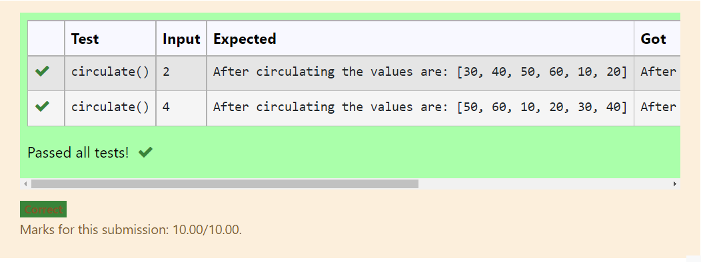

# Circulate-the-values-of-N-variables
## Aim:
To write a python program to circulate the n variables using function concept
## Equipment’s required:
PC
Anaconda - Python 3.7
Step 1: Give a user defined function as def circulate():
Step 2: Give a user defined function as def circulate():
Step 3: give a list with an array of certain numbers
Step 4: Using the slicing concept rotate the list
Step 5: Print the values
Step 6: Print the values
## Program:def circulate():
    n=int(input())
    l=[10,20,30,40,50,60]
    l=l[n:]+l[:n]
    print("After circulating the values are:",l)

## OUTPUT

## Result:
Thus the circulate the values of n variables are executed
